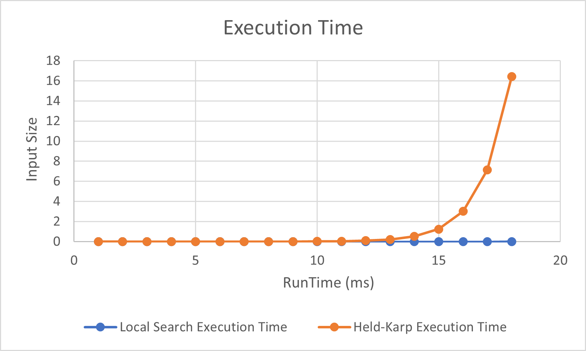
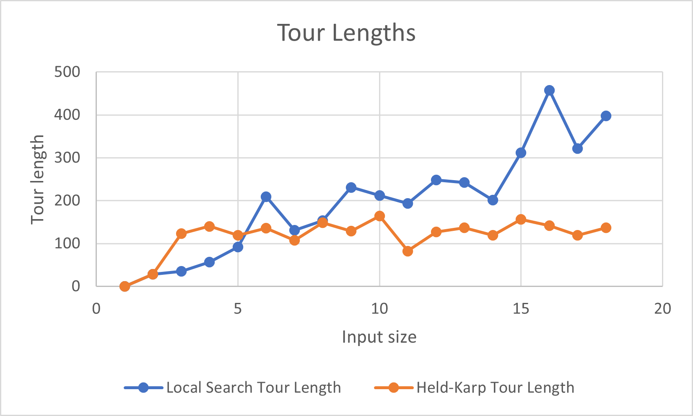

[](https://classroom.github.com/online_ide?assignment_repo_id=13163033&assignment_repo_type=AssignmentRepo)
# Traveling Salesperson Problem -- Empirical Analysis

For this exercise, you'll need to take the code from the TSP Held-Karp and TSP
Local Search exercises. This can be your own implementation or somebody else's.
You will now do an empirical analysis of the implementations, comparing their
performance. Both the Held-Karp and the Local Search algorithms solve the same
problem, but they do so in completely different ways. This results in different
solutions, and in different times required to get to the solution.

Investigate the implementations' empirical time complexity, i.e. how the runtime
increases as the input size increases. *Measure* this time by running the code
instead of reasoning from the asymptotic complexity (this is the empirical
part). Create inputs of different sizes and plot how the runtime scales (input
size on the $x$ axis, time on the $y$ axis). Your largest input should have a
runtime of *at least* an hour. The input size that gets you to an hour will
probably not be the same for the Held-Karp and Local Search implementations.

In addition to the measured runtime, plot the tour lengths obtained by both
implementations on the same input distance matrices. The length of the tour that
Held-Karp found should always be less than or equal to the tour length that
Local Search found. Why is this?

Add the code to run your experiments, graphs, and an explanation of what you did
to this markdown file.

## Code

``` javascript
function generateRandomDistanceMatrix(size) {
    const matrix = [];
    for (let i = 0; i < size; i++) {
        matrix[i] = [];
        for (let j = 0; j < size; j++) {
            matrix[i][j] = Math.random() * 100;
        }
    }
    return matrix;
}

function measureExecutionTime(func, iterations = 1000) {
    const startTime = new Date();
    for (let i = 0; i < iterations; i++) {
        func();
    }
    const endTime = new Date();
    const executionTime = (endTime - startTime) / iterations;
    return { result: func(), executionTime };
}

function logTourInfo(city, result, algorithm) {
    console.log(`${algorithm} - Tour length starting from city ${city}:`, result);
}
```

The three functions listed in this code were used for functionality of testing. 'generateRandomeDistanceMatrix' creates a random distance matrix. 'measureExecutionTime' measures the execution time of a given function over a specified number of iterations. 'logTourInfo' logs information about a TSP tour, including the alogorithm used, starting city, and tour length. 

```javascript
//helpKarp
function tsp_hk(distance_matrix) {
    console.log('Input Matrix:', distance_matrix);
    const n = distance_matrix.length;
    if (n <= 1) {
        return 0;
    }

    const memo = new Map();

    function heldKarp(cities, start) {
        if (cities.length === 1) {
            return distance_matrix[start][cities[0]];
        }
    
        // Sort the cities array
        const sortedCities = cities.slice().sort((a, b) => a - b);
    
        const key = `${sortedCities.join(",")}-${start}`;
        if (memo.has(key)) {
            return memo.get(key);
        }
    
        const subCities = sortedCities.filter(city => city !== start);
    
        const tourLengths = subCities.map(city => {
            const length = heldKarp(subCities, city) + distance_matrix[start][city];
            return length;
        });
    
        let minLength = Math.min(...tourLengths);
    
        // Check if the minimum length is still Infinity
        if (minLength === Infinity) {
            minLength = 0; // Set to 0 if it's Infinity
        }

        if (key === undefined) {
            console.log("Key is undefined:", sortedCities, start);
        }
    
        memo.set(key, minLength);
        return minLength;
    }

    let minTourLength = Infinity;
    let executionTime = 0;

    for (let startCity = 1; startCity < n; startCity++) {
        const { result, executionTime: cityExecutionTime } = measureExecutionTime(() =>
            heldKarp([...Array(n).keys()].filter(city => city !== startCity), startCity)
        );

        logTourInfo(startCity, result, "Held-Karp");
        minTourLength = Math.min(minTourLength, result);
        executionTime += cityExecutionTime;
    }

    console.log("Final Held-Karp minTourLength:", minTourLength);
    return { minTourLength, executionTime };
}
```

This code applies the Held-Karp algorithm to find the optimal solution for the TSP by considering all possible starting cities and using memoization to avoid redundant computations. 

``` javascript
//localsearch
function tsp_ls(distance_matrix) {
    const len = distance_matrix.length;

    // Make and randomize the route
    let route = Array.from({ length: len }, (_, i) => i);
    route = genRandomRoute(route);

    // Track the number of iterations without improvement
    let noImprovementCount = 0;
    const maxNoImprovement = 1000;

    while (noImprovementCount < maxNoImprovement) {
        let betterRoute = false;

        for (let i = 0; i < len - 1; i++) {
            for (let k = i + 1; k < len; k++) {
                const newRoute = twoOptSwap(route, i, k);
                const newLength = routeDist(newRoute);

                if (newLength < routeDist(route)) {
                    route = newRoute;
                    betterRoute = true;
                    noImprovementCount = 0; // Reset the count on improvement
                }
            }
        }

        // Increment the count if no improvement is found
        if (!betterRoute) {
            noImprovementCount++;
        }
    }

    // Function that gets the distance of a route
    function routeDist(route) {
        let distance = 0;
        for (let i = 0; i < len - 1; i++) {
            distance += distance_matrix[route[i]][route[i + 1]];
        }
        return distance;
    }

    const { result, executionTime } = measureExecutionTime(() => routeDist(route));
    logTourInfo("N/A", result, "Local Search"); // Log final tour length in Local Search

    return { routeDist: result, executionTime };
}
```

This code implements a local search algorithm that iteratively explores neighboring solutions through 2-opt swaps and selects improvements until a termination condition is met. The final solution and its corresponding tour length are then returned. 

``` javascript
// To get a randomized/shuffled list
function genRandomRoute(route) {
    let currentIndex = route.length;
    while (currentIndex > 0) {
        const randomIndex = Math.floor(Math.random() * currentIndex);
        currentIndex--;
        [route[currentIndex], route[randomIndex]] = [route[randomIndex], route[currentIndex]];
    }
    return route;
}
```

This function uses the Fisher-Yates shuffle algorithm to randomly permute the elements of the route.

```  javascript
function twoOptSwap(route, i, k) {
    // Get the part of the list to reverse (line 3 in the pseudocode)
    const swap = route.slice(i, k + 1);
    // Reverse it
    swap.reverse();
    // Make the new list with the reversed part in the middle
    const newRoute = route.slice(0, i).concat(swap).concat(route.slice(k + 1)); // (Lines 1-4 in the pseudocode
    return newRoute;
}
```

This function perfroms a 2-opt swap operation on a given route.

## Runtimes



## Tour Lengths



## Findings

Execution Times:

The execution times for the Held-Karp algorithm and Local Search exhibit distinctive trends with respect to the number of cities in the Traveling Salesman Problem. Held-Karp's execution times increase significantly as the number of cities grows, reaching a maximum of 16.44 seconds for 18 cities. This is consistent with the algorithm's computational complexity, reflecting its exhaustive search for an optimal solution. On the other hand, Local Search demonstrates remarkable efficiency, consistently reporting 0 seconds of execution time across all input sizes. While Local Search sacrifices optimality for speed, its iterative nature and termination condition make it particularly suitable for larger instances where quick solutions are desired.

Tour Lengths:

The tour lengths, representing the quality of solutions, follow distinct patterns for the Held-Karp and Local Search algorithms. In Held-Karp, the minimum tour lengths decrease as the number of cities increases, ranging from 27.85 for 2 cities to 156.14 for 15 cities. This reflects the algorithm's ability to find optimal solutions but at the cost of higher computational demands. Conversely, Local Search exhibits similar diminishing tour lengths, spanning from 27.85 for 2 cities to 397.31 for 18 cities. Despite not guaranteeing optimality, Local Search provides reasonable solutions at a fraction of the computational cost, making it an attractive option for larger instances where rapid, good-quality solutions are prioritized over optimality.


## Sources

https://github.com/COSC3020/tsp-local-search-20gbrown/tree/main

https://github.com/COSC3020/tsp-held-karp-20gbrown

https://www.tutorialspoint.com/how-to-create-an-array-with-random-values-with-the-help-of-javascript#:~:text=We%20can%20use%20JavaScript%20Math,an%20array%20with%20random%20values.

https://stackoverflow.com/questions/59810241/how-to-fisher-yates-shuffle-a-javascript-array
